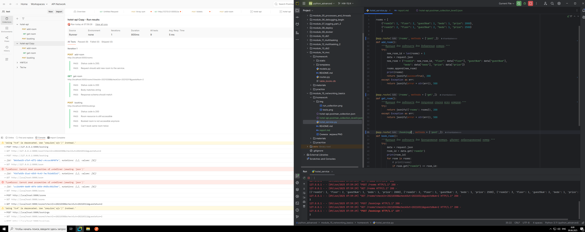

## Определён текущий уровень зрелости.

Текущий уровень зрелости 1(уровни начинаются с 0), так как уже используются различные URI и HTTP методы.
## Обращено внимание на названия endpoint и параметров.

Для перехода на уровень зрелости API 2 нужно перейти к сущностям, и для каждой сущности использовать соответствующий метод, к примеру для добавления номера - метод POST, для получения комнат - метод GET и т.д.

В описании контракта и в скрипте на python были исправлены названия эндпоинтов: 

- add-room на rooms с методом POST.
- get-room на rooms с методом GET.
- booking на bookings с методом POST, т.к. в будущем возможно понадобиться изменять или удалять данные о бронировании. 

## Изменённый контракт оформлен в виде Postman-коллекции.

Файл новой Postman-коллекции и скриншот с работой после изменения приложены ниже:  
[Postman-коллекция level 2](hotel-api.postman_collection_level3.json) - ссылка на файл с новой коллекцией. 
 - скриншот с демонстрацией работы новой коллекции. 
