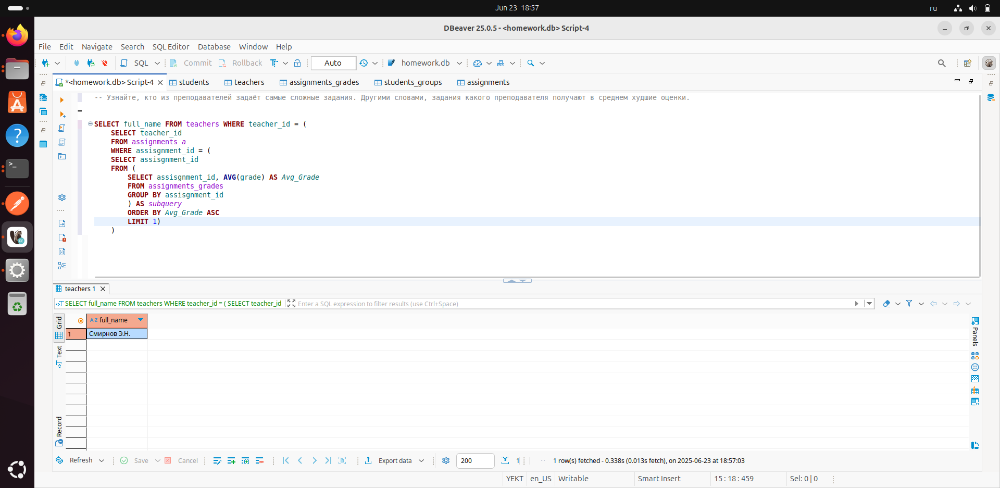

### Перед выполнением задания запустите файл generate_practice_and_homework_db.py!

Узнайте кто из преподавателей задает самые сложные задания. Иначе говоря задания какого преподавателя получают в среднем самые худшие оценки

### Запрос:
```SELECT full_name FROM teachers WHERE teacher_id = (
	SELECT teacher_id 
	FROM assignments a  
	WHERE assisgnment_id = (
	SELECT assisgnment_id
	FROM (
    	SELECT assisgnment_id, AVG(grade) AS Avg_Grade
    	FROM assignments_grades
    	GROUP BY assisgnment_id
		) AS subquery
		ORDER BY Avg_Grade ASC
		LIMIT 1) 
	)
```

### Скриншот с демонстацией работы запроса: 

