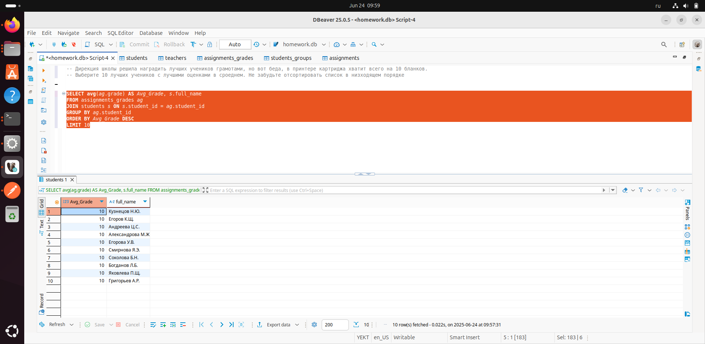

### Перед выполнением задания запустите файл generate_practice_and_homework_db.py!

Дирекция школы решила наградить лучших учеников грамотами, но вот беда, в принтере картриджа хватит всего на 10 бланков. Выберите 10 лучших учеников с лучшими оценками в сроеднем. Не забудьте отсортировать список в низходящем порядке

### Запрос: 
```
SELECT avg(ag.grade) AS Avg_Grade, s.full_name  
FROM assignments_grades ag 
JOIN students s ON s.student_id = ag.student_id 
GROUP BY ag.student_id 
ORDER BY Avg_Grade DESC 
LIMIT 10
```

### Скриншот с демонстацией работы запроса: 


