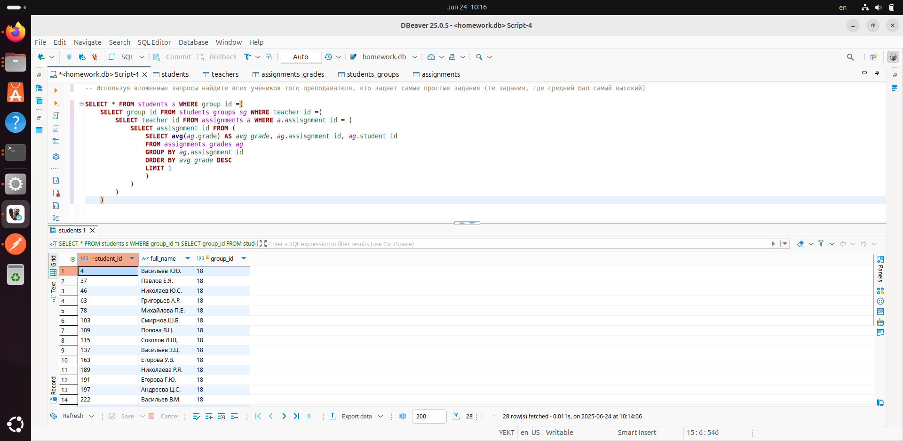

### Перед выполнением задания запустите файл generate_practice_and_homework_db.py!

Используя вложенные запросы найдите всех учеников того преподавателя, кто задает самые простые задания (те задания, где средний бал самый высокий)

* задание со звездочкой: напишите этот же запрос с использованием одного из join

### Запрос
```
SELECT * FROM students s WHERE group_id =( 
	SELECT group_id FROM students_groups sg WHERE teacher_id =(
		SELECT teacher_id FROM assignments a WHERE a.assisgnment_id = (
			SELECT assisgnment_id FROM (
				SELECT avg(ag.grade) AS avg_grade, ag.assisgnment_id, ag.student_id
				FROM assignments_grades ag 
				GROUP BY ag.assisgnment_id
				ORDER BY avg_grade DESC
				LIMIT 1
				)
			)
		)
	)
```

### Скриншот с демонстацией работы запроса: 


