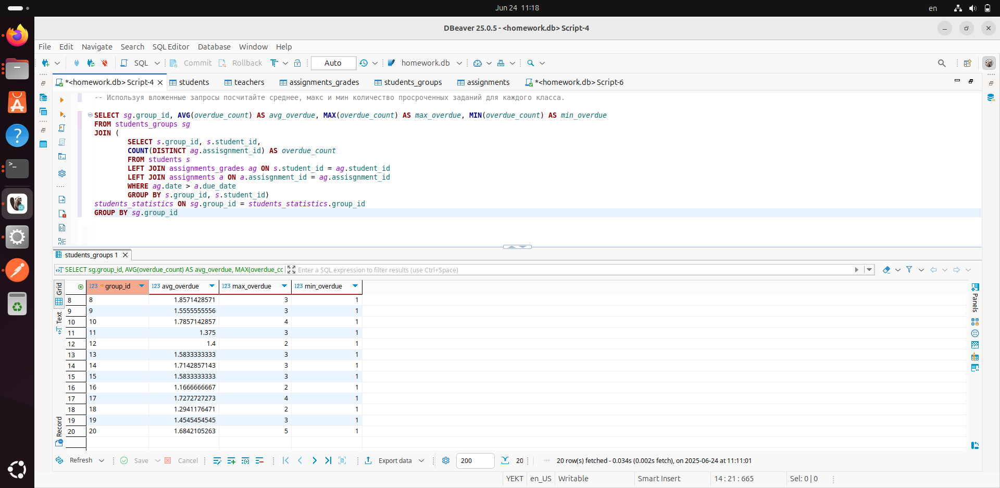

### Перед выполнением задания запустите файл generate_practice_and_homework_db.py!

Используя вложенные запросы посчитайте среднее, макс и мин количество просроченных заданий для каждого класса.

* задание со звездочкой: напишите этот же запрос с использованием одного из join

### Запрос: 
```SELECT sg.group_id, AVG(overdue_count) AS avg_overdue, MAX(overdue_count) AS max_overdue, MIN(overdue_count) AS min_overdue
FROM students_groups sg 
JOIN (
		SELECT s.group_id, s.student_id,
		COUNT(DISTINCT ag.assisgnment_id) AS overdue_count
		FROM students s 
		LEFT JOIN assignments_grades ag ON s.student_id = ag.student_id 
		LEFT JOIN assignments a ON a.assisgnment_id = ag.assisgnment_id 
		WHERE ag.date > a.due_date 
		GROUP BY s.group_id, s.student_id)
students_statistics ON sg.group_id = students_statistics.group_id
GROUP BY sg.group_id
```

### Скриншот с демонстацией работы запроса: 

