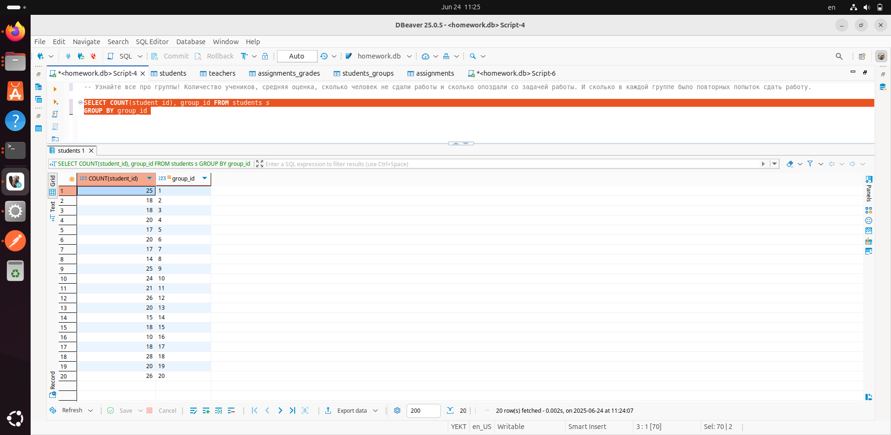
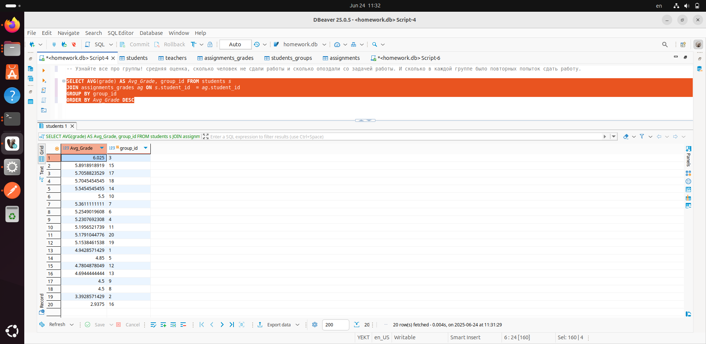
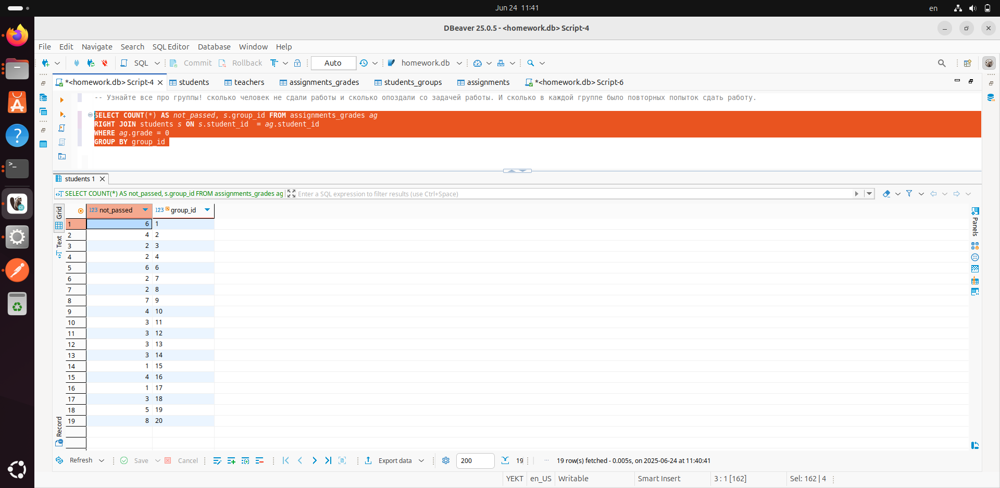
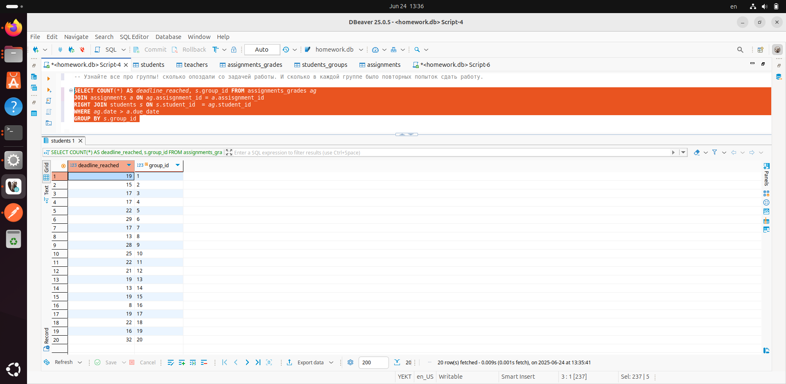
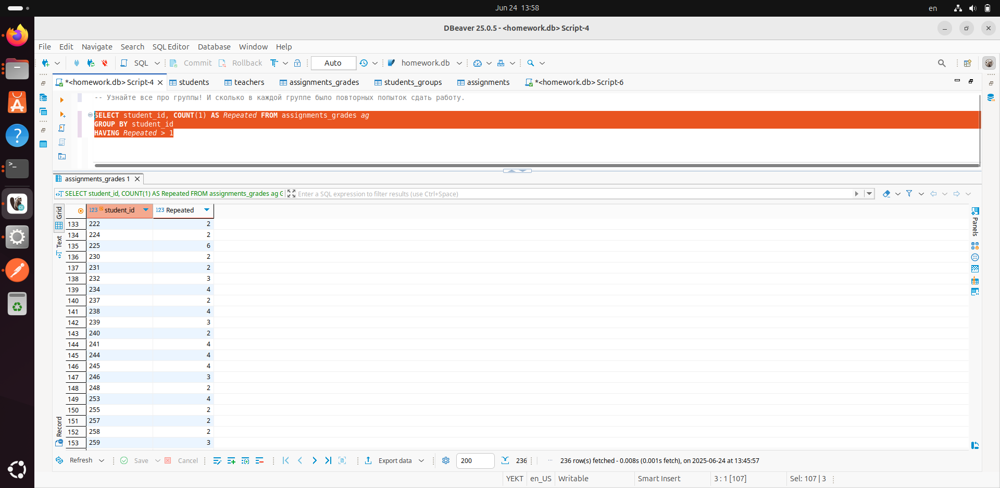

### Перед выполнением задания запустите файл generate_practice_and_homework_db.py!

Узнайте все про группы! Количество учеников, средняя оценка, сколько человек не сдали работы и сколько опоздали со задачей работы. И сколько в каждой группе было повторных попыток сдать работу.

### Запрос для подсчета количества учеников в каждой группе:

```
SELECT COUNT(student_id), group_id FROM students s 
GROUP BY group_id 
```
### Скриншот с демонстацией работы запроса: 



### Запрос для подсчета средней оценки учеников в каждой группе:

```
SELECT AVG(grade) AS Avg_Grade, group_id FROM students s 
JOIN assignments_grades ag ON s.student_id  = ag.student_id
GROUP BY group_id 
ORDER BY Avg_Grade DESC
```
### Скриншот с демонстацией работы запроса: 



### Запрос для подсчета количества учеников, которые не сдали работы, в каждой группе:

```
SELECT COUNT(*) AS not_passed, s.group_id FROM assignments_grades ag
RIGHT JOIN students s ON s.student_id  = ag.student_id
WHERE ag.grade = 0 
GROUP BY group_id 
```
### Скриншот с демонстацией работы запроса: 




### Запрос для подсчета количества учеников, которые просрочили дедлайн, в каждой группе:

```
SELECT COUNT(*) AS deadline_reached, s.group_id FROM assignments_grades ag
JOIN assignments a ON ag.assisgnment_id = a.assisgnment_id 
RIGHT JOIN students s ON s.student_id  = ag.student_id
WHERE ag.date > a.due_date
GROUP BY s.group_id 
```
### Скриншот с демонстацией работы запроса: 



### Запрос для подсчета количества учеников, которые просрочили дедлайн, в каждой группе:

```
SELECT student_id, COUNT(1) AS Repeated FROM assignments_grades ag 
GROUP BY student_id
HAVING Repeated > 1
```
### Скриншот с демонстацией работы запроса: 


