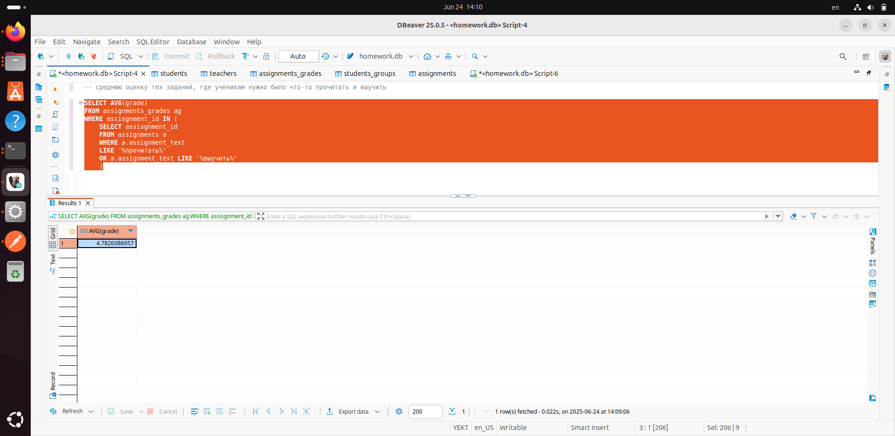

### Перед выполнением задания запустите файл generate_practice_and_homework_db.py!

Используя подзапросы выведите среднюю оценку тех заданий, где ученикам нужно было что-то прочитать и выучить

### Запрос для подсчета средней оценки тех заданий, где ученикам нужно было что-то прочитать и выучить:

```
SELECT AVG(grade) 
FROM assignments_grades ag 
WHERE assisgnment_id IN (
	SELECT assisgnment_id 
	FROM assignments a 
	WHERE a.assignment_text 
	LIKE '%прочитать%' 
	OR a.assignment_text LIKE '%выучить%'
	) 
```
### Скриншот с демонстацией работы запроса: 

